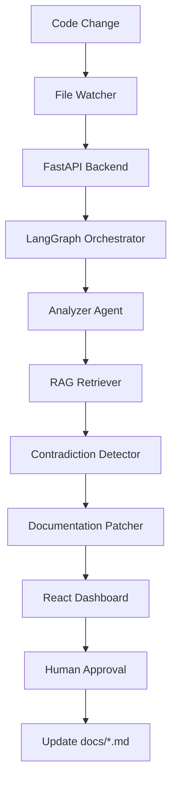

<div align="center">

# 🔄 SYNCHRON

### Autonomous Code-to-Doc Synchronization — Multi-Agent Documentation Intelligence with Local LLM

[](https://www.python.org/)
[](https://fastapi.tiangolo.com/)
[](https://react.dev/)
[](https://langchain.com/)
[](https://huggingface.co/Qwen/Qwen2.5-7B-Instruct-GGUF)
[](LICENSE)

<br/>

> **SYNCHRON** is an autonomous multi-agent system designed to eliminate documentation drift. It monitors your codebase in real-time, analyzes the logical intent of changes using a local Qwen 2.5 7B model, and automatically generates high-fidelity markdown patches for your documentation—ensuring your docs never fall behind your code.

<br/>

   

</div>

---

## 📋 Table of Contents

- [Overview](#-overview)
- [Application Preview](#-application-preview)
- [Features](#-features)
- [Architecture](#-architecture)
- [Tech Stack](#-tech-stack)
- [Project Structure](#-project-structure)
- [Installation](#-installation)
- [Usage](#-usage)
- [API Reference](#-api-reference)
- [Configuration](#-configuration)
- [License](#-license)

---

## 🧠 Overview

**SYNCHRON** solves the "Stale Docs" problem by treating documentation as a living extension of code. Built with a local-first philosophy, it runs entirely on your machine without external API dependencies.

When a developer saves a `.py` or `.js` file:
1. **The Watcher** detects the modification instantly.
2. **The Analyzer Agent** extracts the new logical intent.
3. **The RAG Engine** retrieves relevant documentation from a local ChromaDB vector store.
4. **The Detector Agent** identifies contradictions between the code and the retrieved docs.
5. **The Patcher Agent** generates a precise markdown patch for human approval.

---

## 🖼️ Application Preview

<div align="center">

### 1) Main Dashboard
*Real-time analysis log showing agents traversing the LangGraph.*


<br/>

### 2) The Healing Process
*Side-by-side diff viewer showing the AI-proposed documentation fix.*


</div>

---

## ✨ Features

| Feature | Description |
|---|---|
| 👁️ **Real-time Monitoring** | `watchdog`-based system that triggers analysis the millisecond you hit Save. |
| 🤖 **Multi-Agent Logic** | LangGraph-powered workflow with specialized Analyzer, Detector, and Patcher agents. |
| 🏰 **Local-First AI** | Powered by `llama.cpp` and Qwen 2.5 7B. No data leaves your machine. |
| 📚 **Semantic RAG** | ChromaDB integration for intelligent documentation retrieval based on code intent. |
| 🛠️ **H.I.L Approval** | Human-in-the-loop dashboard with `react-diff-viewer` for one-click patch approval. |
| 🎨 **Premium UI** | Glassmorphism design with Tailwind CSS v4 and Framer Motion animations. |

---

## 🏗️ Architecture



---

## 🛠️ Tech Stack

| Layer | Technology |
|---|---|
| **Orchestration** | LangGraph, LangChain |
| **Inference** | Llama.cpp (OpenAI-compatible server) |
| **Model** | Qwen 2.5 7B Instruct (GGUF Q5_K_M) |
| **Backend** | FastAPI, Pydantic, Watchdog |
| **Database** | ChromaDB (Vector Store) |
| **Frontend** | React 18, Vite, Tailwind CSS v4 |
| **Styling** | Framer Motion, Lucid Icons |

---

## 📁 Project Structure

```
synchron-self_healing_docs/
│
├── backend/
│   ├── agents/
│   │   ├── graph.py           # LangGraph workflow definition
│   │   └── nodes.py           # Specialized agent logic
│   ├── utils/
│   │   ├── rag.py             # ChromaDB integration
│   │   ├── watcher.py         # File system monitoring
│   │   └── ingest.py          # Documentation indexing script
│   ├── main.py                # FastAPI entry point
│   └── requirements.txt       # Backend dependencies
│
├── frontend/
│   ├── src/
│   │   ├── App.jsx            # Dashboard logic
│   │   ├── index.css          # Tailwind v4 styles
│   │   └── components/        # UI components
│   └── vite.config.js         # Vite + Tailwind v4 plugin
│
├── docs/                      # Target Markdown documentation
├── src/                       # Monitored source code folder
└── README.md
```

---

## 🚀 Installation

### 1) Start the Brain (Local LLM)
Download [Qwen-2.5-7B-Instruct-GGUF](https://huggingface.co/Qwen/Qwen2.5-7B-Instruct-GGUF) and run the server:

```bash
llama-server -m "./models/qwen2.5-7b-q5.gguf" --port 8080 -ngl 0 -t 4 -c 4096
```

### 2) Backend Setup
```bash
cd backend
python -m venv venv
venv\Scripts\activate
pip install -r requirements.txt
python main.py
```

### 3) Frontend Setup
```bash
cd frontend
npm install
npm run dev
```

---

## 📡 API Reference

| Method | Endpoint | Description |
|---|---|---|
| `GET` | `/results` | Fetch all pending analysis and patch results |
| `POST` | `/approve` | Approve and apply a documentation patch |
| `GET` | `/status` | Check system and watcher health |

---

## ⚙️ Configuration

`backend/.env`:
```bash
CHROMA_DB_PATH=./chroma_db
DOCS_PATH=../docs
WATCH_PATH=../src
LLM_BASE_URL=http://localhost:8080/v1
```

---

## License

This project is licensed under the MIT License. See [LICENSE](./LICENSE).

<div align="center">
Built by Telvin Crasta · Self-Healing Intelligence · Production-ready
<br/>
⭐ If SYNCHRON helped you maintain your documentation, star the repo.
</div>
